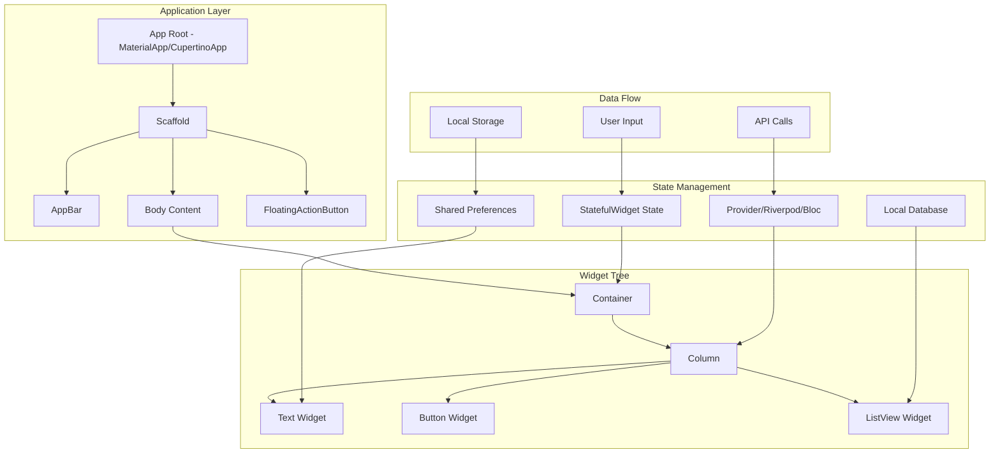

# Flutter Application Architecture

## Overview

This note summarizes the core building blocks of a Flutter application—widgets, gestures, state, and framework layers—and how they collaborate at runtime. Content is adapted and paraphrased from "Flutter – Architecture Application" (GeeksforGeeks) and Flutter docs.

## Introduction

Flutter apps are composed of widgets arranged in a tree. A typical app starts with an app root (e.g., `MaterialApp` or `CupertinoApp`) and a `Scaffold` that provides visual structure (app bar, body, FAB, etc.). Widgets describe what to render; the framework turns that description into elements and render objects that measure, layout, paint, and animate pixels on the screen.

## Widgets

Widgets are immutable UI descriptions. They:

- Define structure, styling, and behavior for parts of the UI.
- Compose into a widget tree (the entire app is a widget built from smaller widgets).
- Common roots: `MaterialApp` → `Scaffold` → `AppBar`/`Body` → content widgets (e.g., `Center`, `Text`, `ListView`).

Under the hood:

- Widget Tree: immutable configuration.
- Element Tree: live instances that hold widget-to-render relationships.
- Render Tree: objects that perform layout, painting, and hit testing.

## Gestures

Flutter turns pointer input (touch, mouse, stylus) into gesture events. You typically use:

- `GestureDetector` to listen for taps, double-taps, long-press, pan/drag, scale, etc.
- Higher-level widgets (e.g., `InkWell`, `InkResponse`) for material ripple and common interactions.

Gestures update state, trigger animations, and cause the framework to rebuild affected parts of the UI.

## Concept of State

UI in Flutter is a function of state. When state changes, dependent widgets rebuild.

- Ephemeral UI state: short-lived, local to a widget; managed with `StatefulWidget` + `setState()`.
- App/shared state: spans screens or sessions; managed via patterns like `InheritedWidget`/`Provider`, Riverpod, BLoC, Redux, etc.

Rebuilds are efficient because only affected subtrees update; the whole app is not re-rendered.

## Layers

Flutter is layered for performance and flexibility:

- App Layer (your code): Widgets, State, Gestures, Navigation.
- Framework (Dart): Rendering, Painting, Layout, Animation, Scheduler, Semantics.
- Engine (C++): Skia renderer, text shaping, image codecs, accessibility bridges.
- Embedder (Platform): Android/iOS/Web/Desktop integration, event loop, surfaces.

Higher layers depend on lower layers; most app code lives in the widget layer and uses the framework APIs.

## States

Two primary widget types model state needs:

- StatelessWidget: has no mutable state; rebuilds only when inputs (props) change.
- StatefulWidget: owns mutable state in a `State` object; call `setState()` to schedule rebuilds.

Guidelines:

- Keep state as small and as local as possible.
- Lift state up only when multiple descendants need it.
- Use dedicated state management for shared/app-wide data.

## A Flutter Application Architecture

This alternative view focuses on the component hierarchy and data flow patterns in a typical Flutter application.

### Key Architectural Principles:

1. **Separation of Concerns**: UI components are separate from business logic
2. **Unidirectional Data Flow**: Data flows down from parent to child widgets
3. **State Isolation**: Each widget manages its own local state when possible
4. **Composition over Inheritance**: Complex UIs are built by composing simple widgets
5. **Reactive Programming**: UI automatically updates when state changes

### Component Responsibilities:

- **App Root**: Provides theme, navigation, and app-level configuration
- **Scaffold**: Defines the basic visual layout structure
- **Widgets**: Handle specific UI rendering and user interactions
- **State Management**: Manages data that affects multiple widgets
- **Data Sources**: Provide data to the application (APIs, databases, etc.)

This architecture ensures maintainable, testable, and scalable Flutter applications.

Notes:

- Gestures mutate state; state drives widget rebuilds; widgets produce elements and render objects.
- Rendering flows down to the engine (Skia) and finally to the platform surfaces via the embedder.
